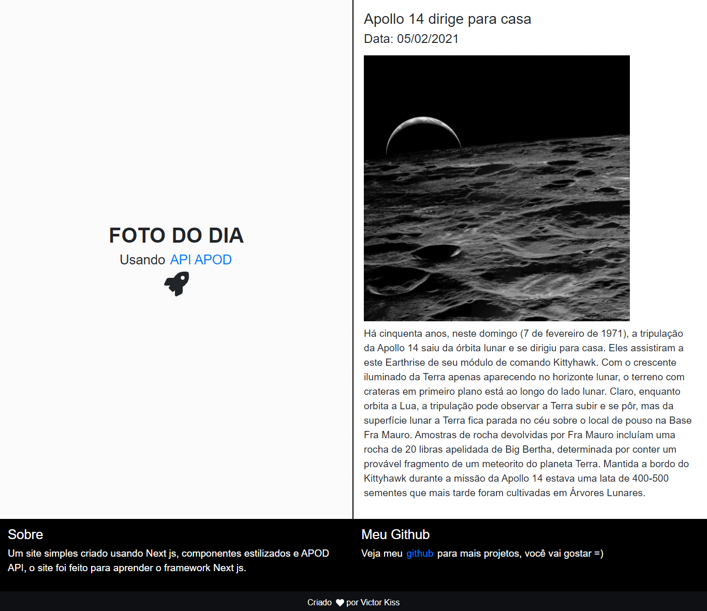

## Foto do dia
Esse é um site simples feito em Next js juntamente com styled components, o site foi usado como forma de aprendizado do Next js, styled components e alguns padrões de projeto e consumo de api. O site foi feito durante uma noite em que eu estava entediado.



## Requisitos

-Node js
- Editor de código para modificar e visualizar o projeto.

## Instalação

Primeiramente, para instalar baixe o zip do projeto e clique em extrair, abra a pasta do projeto em um editor de códigos e rode o comando:

```
npm install
# ou
yarn add
```

Abra [http://localhost:3000](http://localhost:3000) com 
seu navegador para ver os resultados.

Para modificar o projeto basta ir alterando os arquivos. O css de componentes como Footer ficam dentro do próprio componente, a estilização é feita a partir do styled components. 

## OBS

No arquivo global.js fica o estilo de algumas classes já definidas e também estilos de elementos como h1, h2, p dentre outros.

O arquivo "_document.jsx" se refere a renderização do site, com ele é aplicado o server side redering e a página já chega estilizada no front end, comportamento esse que não é padrão.
